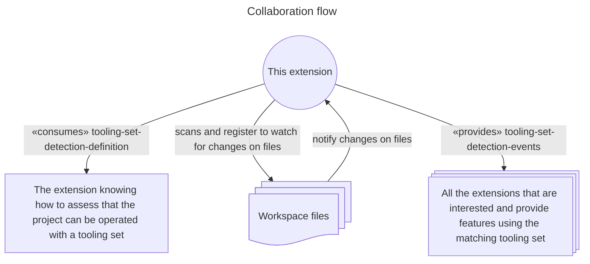

# A suitable tooling set detection service, for Pulsar

An extension for Pulsar, a Community-led Hyper-Hackable Text Editor, that is able to watch the projects for hints about a set of tooling that would be suitable to operate on them.

This extension MUST receive a sensor specification to know what to watch for, for a given tooling set.

Then, it is watching the project, more specifically :

* each root directory in the workspace, looking for the specified hint.
* If not found in a root directory, do the same for each direct subfolder.
* and it's not going further.

In other work, either a root directory can be operated with a tooling set, or it MAY be a container for a collection of projects.

Upon finding one or more "interesting folders", it send a detection event.

Also, it watches for any modifications that would change the set of interesting folders, like :

* An interesting folder appear.
* An interesting folder disappear.
* A root folder stops being interesting, revealing a set of interesting direct subfolders.
* A root folder starts being interesting, masking a set of interesting direct subfolders.

Finally, a tooling-set can be prioritized against others (e.g. `GNU make` should be ignored for every folder where `cmake` is found suitable).

