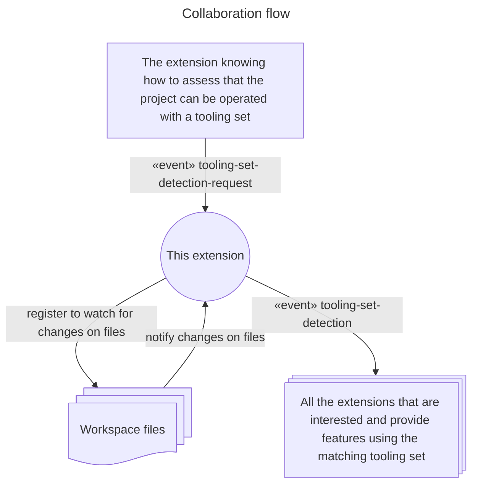

# A suitable tooling set detection service, for Pulsar

An extension for Pulsar, a Community-led Hyper-Hackable Text Editor, that is able to watch the projects for hints about a set of tooling that would be suitable to operate on them.

This extension MUST receive a sensor specification to know what to watch for, for a given tooling set.

Then, it is watching the project, and notify other extensions when the sensor has been triggered.

